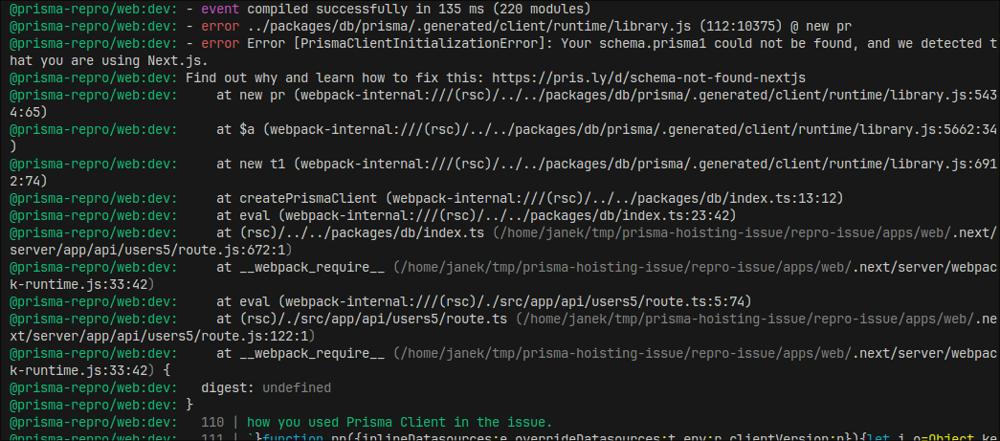

# Reproduce Prisma issue "schema.prisma1" not found

## Steps

1. (optional) change path of sqlite db in `packages/db/prisma/schema.prisma` (defaults to `/tmp/prisma-repro-dev.db`)
1. `pnpm init-repro`
1. `pnpm dev`
1. Go to http://localhost:3000
1. Click all the links, watch terminal output


### Expected behavior
No errors/issues

### Actual behavior

**Sometimes** page generation fails with the following error:

```
Error [PrismaClientInitializationError]: Your schema.prisma1 could not be found, and we detected that you are using Next.js
```


